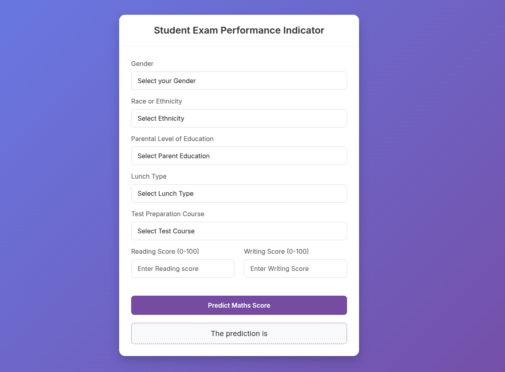

# Student Performance Indicator

This is an End-to-End Machine Learning application that predicts student performance based on various influencing factors such as gender, ethnicity, parental education level, lunch type, and test preparation course.  
The project includes a complete training pipeline, a Flask-based web application for real-time predictions, and a CI/CD deployment pipeline using GitHub Actions, Docker, AWS EC2, and AWS ECR.

## Table of Contents

- Project Overview
- Application UI Preview
- Project Structure
- Getting Started
- Local Execution
- Deployment
- Docker Setup in EC2
- GitHub Actions and Secrets
- Future Improvements
- License

## Project Overview

Goal: Predict student test scores including Math, Reading, and Writing.

Tech Stack:

- Python
- Flask
- Scikit-learn
- Pandas, NumPy
- GitHub Actions, Docker, AWS EC2, AWS ECR

Deployment: Fully containerized deployment using Docker and AWS.

## Application UI Preview

The following screenshot shows the input form used to predict a student's Math score based on selected attributes.



## Project Structure

```
Student_Performance_Indicator/
├── artifacts/              # Stores trained model and preprocessor objects
├── notebook/               # EDA and experimentation notebooks
├── src/                    # Source code for the ML pipeline
│   ├── components/         # Data ingestion, transformation, model trainer modules
│   ├── pipeline/           # Training and prediction pipelines
│   ├── logger.py           # Custom logging configuration
│   └── exception.py        # Custom exception classes
├── templates/              # HTML templates for the Flask app
├── application.py          # Flask application entry point
├── Dockerfile              # Docker container configuration
├── requirements.txt        # Python dependencies
└── .github/workflows/      # GitHub Actions CI/CD workflow files
```

## Getting Started

### 1. Clone the Repository

```sh
git clone https://github.com/nikhill03/Student_Performance_Indicator
cd Student_Performance_Indicator
```

### 2. Create a Virtual Environment

Using Conda:

```sh
conda create -p venv python=3.8 -y
conda activate venv/
```

### 3. Install Dependencies

```sh
pip install -r requirements.txt
```

### 4. Run the Application

```sh
python application.py
```

Open the browser:

```
http://127.0.0.1:5000/
```

## Local Docker Run

Build the Docker image:

```sh
docker build -t student-app .
```

Run the container:

```sh
docker run -p 5000:5000 student-app
```

Access locally:

```
http://127.0.0.1:5000/
```

## Deployment

This project includes a GitHub Actions workflow for automated CI/CD, automatically building and pushing a Docker image to AWS ECR and running it in EC2.

Deployment Checklist:

- [x] Dockerfile validated
- [x] GitHub workflow configured
- [x] IAM user created for ECR and EC2 access

## Docker Setup in EC2

Connect to EC2 instance and run:

### Optional: Update system

```sh
sudo apt-get update -y
sudo apt-get upgrade -y
```

### Required: Install Docker

```sh
curl -fsSL https://get.docker.com -o get-docker.sh
sudo sh get-docker.sh
sudo usermod -aG docker ubuntu
newgrp docker
```

### Configure EC2 as Self-Hosted Runner

GitHub Repository → Settings → Actions → Runners → New self-hosted runner  
Choose Linux → run given commands on EC2 instance.

## GitHub Actions and Secrets Setup

Add repository secrets:
GitHub → Settings → Secrets and variables → Actions → New repository secret

| Secret Name           | Description                          | Example                                  |
| --------------------- | ------------------------------------ | ---------------------------------------- |
| AWS_ACCESS_KEY_ID     | IAM Access Key                       | AKIAXXXXXXXXXXXXX                        |
| AWS_SECRET_ACCESS_KEY | IAM Secret Key                       | abc123examplekey                         |
| AWS_REGION            | AWS region configured for deployment | us-east-1                                |
| AWS_ECR_LOGIN_URI     | AWS ECR login URI                    | example.dkr.ecr.ap-south-1.amazonaws.com |
| ECR_REPOSITORY_NAME   | ECR repository name                  | student-performance                      |

## Future Improvements

- Model performance monitoring
- Retraining automation
- Centralized database for predictions
- Enhanced UI design
